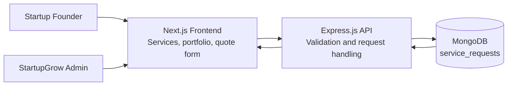
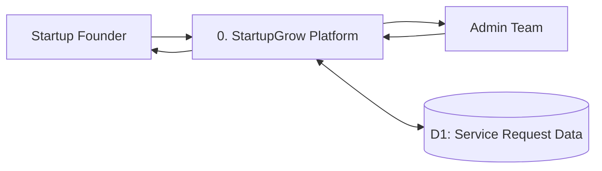
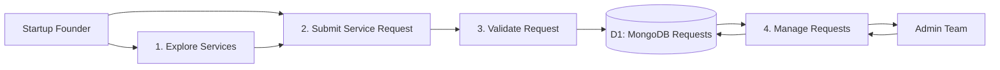
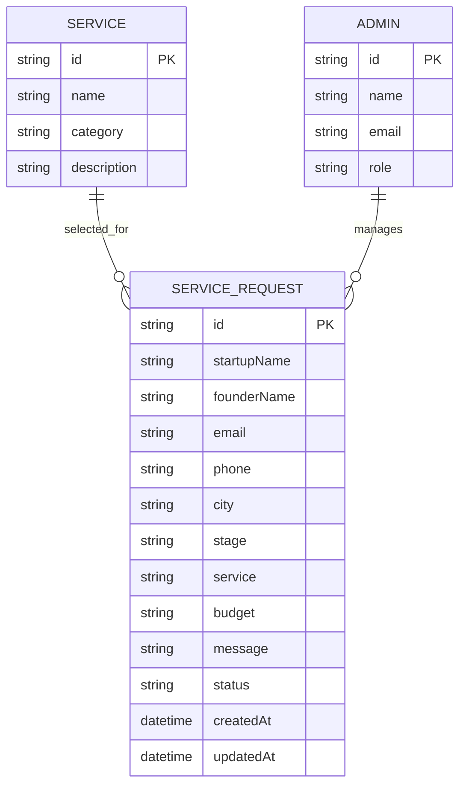
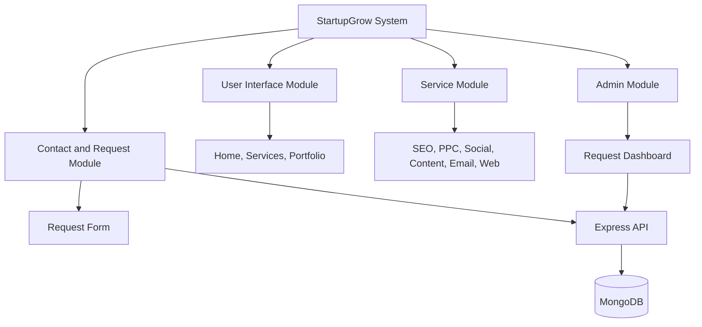

# StartupGrow Diagrams

These diagrams are written in Mermaid format and can be viewed in GitHub, VS Code Mermaid extensions, or Mermaid Live Editor.

## System Architecture

## DFD Level 0

## DFD Level 1

## ER Diagram

## Module Diagram

